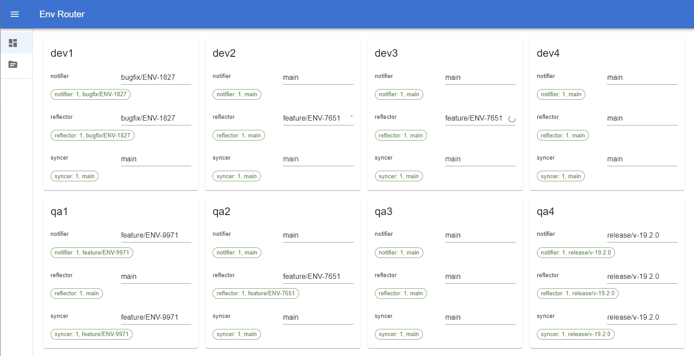

# Envrouter - Continuous Delivery Orchestrator for Kubernetes

## What is Envrouter?

### Development team problems

* When development team has multiple environments, every member wants to know what version of each service is deployed
on each environment.
* Also, every team member wants to set the git branch of the service expected on the environment.

### How Envrouter helps

* Envrouter shows every service at every environment, and it's git branch.
* Envrouter returns to CI/CD pipeline a list of environments the deploying service must be deployed.
* When user changes git branch in Envrouter table, Envrouter triggers deploying CI/CD pipeline.

# Install Envrouter

## Docker

    docker run -it -v $HOME/.kube/config:/home/envrouter/.kube/config jonasasx/envrouter:latest

## Helm install

    helm repo add envrouter https://jonasasx.github.io/envrouter-helm
    helm install my-release envrouter/envrouter

Helm reference: https://github.com/jonasasx/envrouter-helm/blob/master/charts/envrouter/README.md

## Usage

Set label `envrouter.io/app=<your application name>` to `deployment.metadata.labels` and
`deployment.spec.template.metadata.labels`. Envrouter watches for such deployments and pods to display
at the dashboard.

CI/CD pipeline must set annotations:

* `envrouter.io/ref=%GIT_BRANCH_NAME%` to `metadata.annotations` and `spec.template.metadata.annotations` 
* `envrouter.io/sha=%GIT_COMMIT_SHA%` to `metadata.annotations` and `spec.template.metadata.annotations` 

Example:

    apiVersion: apps/v1
    kind: Deployment
    metadata:
      name: notifier
      namespace: qa2
      labels:
        envrouter.io/app: notifier
      annotations:
        envrouter.io/ref: main
        envrouter.io/sha: 87cf26c39505769e5fcf8133417f36e1883650f0
    spec:
      selector:
        matchLabels:
          app: notifier
      template:
        metadata:
          labels:
            app: notifier
            envrouter.io/app: notifier
          annotations:
            envrouter.io/ref: main
            envrouter.io/sha: 87cf26c39505769e5fcf8133417f36e1883650f0
        spec:
          containers:
            - name: notifier
              image: nginx:latest

